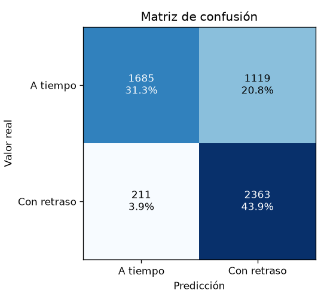
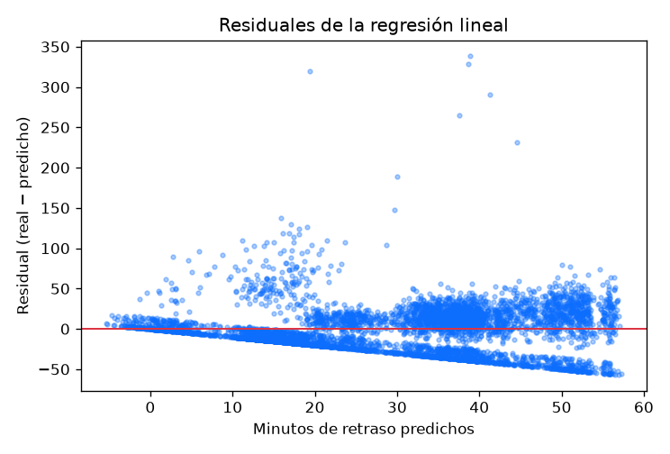

# Unidad III — Análisis supervisado

## 1. Justificación del algoritmo utilizado

### 1.1 Por qué comparar dos clasificadores y no asegurar uno solo

El proyecto entrena y evalúa **dos** algoritmos de clasificación sobre la
misma partición de datos y elige entre ellos por su F1 en el conjunto de
prueba (`ml/supervised.py::train_classifier`), en vez de comprometerse de
antemano con uno solo. La razón es metodológica: afirmar sin comparar que
"Random Forest es mejor" (o que la regresión logística lo es) es una
suposición, no un resultado. Entrenar ambos bajo el mismo pipeline,
partición y validación cruzada convierte la elección en algo verificable.

- **Regresión logística** — línea base interpretable. Sus coeficientes se
  leen directamente como el peso de cada variable sobre la probabilidad de
  retraso, lo cual importa en un proyecto donde una de las preguntas del
  caso de estudio es "¿qué factores influyen en el retraso?", no solo
  "¿cuál es la probabilidad?".
- **Random Forest** — el retador. Captura interacciones no lineales entre
  variables (ruta × franja horaria × antigüedad del vehículo) que una
  regresión logística sin términos de interacción explícitos no puede
  representar, y entrega una importancia de variables basada en la
  reducción de impureza.

El criterio de selección es el **F1** sobre el conjunto de prueba
(sección 3): el promedio armónico de precisión y sensibilidad, apropiado
aquí porque ninguna de las dos clases (a tiempo / con retraso) domina tan
fuertemente como para que la exactitud sola sea suficiente.

### 1.2 Por qué regresión lineal para los minutos de retraso

Para la segunda pregunta —cuántos minutos de retraso esperar, no solo si
habrá retraso— se usa regresión lineal múltiple
(`ml/supervised.py::train_regressor`), que es el algoritmo que el temario de
la unidad exige para esta tarea y que además es el punto de comparación
correcto: si un modelo lineal ya explica una fracción razonable de la
varianza, no hay necesidad de justificar un modelo no lineal más costoso de
interpretar para esta segunda pregunta.

## 2. Descripción del diseño del modelo

### 2.1 Variables predictoras

| Numéricas | Categóricas |
|---|---|
| `distance_km` | `route_code`, `route_type`, `zone`, `distance_range` |
| `planned_duration_min` | `time_band`, `vehicle_type`, `vehicle_age_range` |
| `cargo_weight_kg` | `operator_seniority_range`, `customer_type`, `is_weekend` |
| `packages_count`, `day_of_week` | |

Todas son conocidas **antes** de que la entrega salga — la condición que
hace a un modelo de predicción de retraso útil en la práctica (sección
2.2).

### 2.2 Exclusión de variables por fuga de datos

`ml/datasets.py` declara explícitamente `LEAKAGE_COLUMNS`:

```python
LEAKAGE_COLUMNS = frozenset({
    "actual_departure",
    "actual_arrival",
    "status",
    "delay_cause",
    "delay_cause_code",
    "actual_duration_min",
    "delay_minutes",
    "is_delayed",
})
```

`actual_departure`, `actual_arrival`, `status` y `delay_cause` se conocen
únicamente **después** de que la entrega ocurrió: no existen en el momento
en que alguien querría usar el modelo para decidir algo. Incluirlas en las
variables predictoras produciría una exactitud cercana al 100% —porque el
estatus de la entrega o la hora real de llegada básicamente contienen la
respuesta— y, al mismo tiempo, un modelo sin ningún valor predictivo real,
porque en producción esos datos todavía no existirían cuando se necesita la
predicción. `ml/tests/test_datasets.py` verifica de forma automática que
ninguna de estas columnas aparezca en la matriz de entrenamiento
(`FEATURE_COLUMNS`).

### 2.3 Pipeline y protocolo de evaluación

```python
ColumnTransformer([
    ("num", StandardScaler(), NUMERIC_FEATURES),
    ("cat", OneHotEncoder(handle_unknown="ignore", sparse_output=False), CATEGORICAL_FEATURES),
])
```

El preprocesamiento vive dentro de un `sklearn.pipeline.Pipeline` junto con
el estimador. Esto garantiza que el escalado se ajuste **solo** con el
conjunto de entrenamiento (nunca con datos de prueba) y que el artefacto
`.joblib` guardado sea autocontenido — no requiere ningún paso externo de
preprocesamiento antes de predecir.

- **Partición:** 80% entrenamiento / 20% prueba, **estratificada** por la
  clase objetivo (`is_delayed`), para que la proporción de entregas
  retrasadas sea la misma en ambos subconjuntos.
- **Validación cruzada:** 5 pliegues sobre el conjunto de entrenamiento,
  usando F1 como métrica, para tener una estimación de la estabilidad del
  modelo además del desempeño puntual sobre el conjunto de prueba.

Sobre el conjunto de 26,886 entregas cerradas: 21,508 de entrenamiento y
5,378 de prueba.

## 3. Reporte de evaluación y optimización

### 3.1 Clasificación — ¿llegará tarde? (P8)

| Algoritmo | Exactitud | Precisión | Sensibilidad | F1 | ROC-AUC | F1 (VC 5 pliegues) |
|---|---|---|---|---|---|---|
| **Regresión logística** (ganador) | 0.7527 | 0.6786 | 0.9180 | **0.7804** | 0.7861 | 0.7797 |
| Random Forest | 0.7512 | 0.6783 | 0.9134 | 0.7785 | 0.7774 | 0.7789 |

La regresión logística gana por F1 (0.7804 contra 0.7785) — un margen
pequeño pero consistente también en la validación cruzada (0.7797 contra
0.7789), lo que descarta que la diferencia sea ruido de una sola partición.
Random Forest no aporta una ventaja medible: las interacciones que se
sembraron en el generador ya son separables con las variables categóricas
tal cual (`zone`, `route_code`), sin necesitar fronteras no lineales
adicionales.

Ambos superan el umbral de F1 ≥ 0.75 exigido por el criterio de éxito del
proyecto.

**Matriz de confusión** (filas = real, columnas = predicho; sobre 5,378
casos de prueba):

```
                 Predicho: a tiempo   Predicho: con retraso
Real: a tiempo          1685                 1119
Real: con retraso        211                 2363
```



### 3.2 Regresión — minutos de retraso

| Métrica | Valor |
|---|---|
| **MSE** (error cuadrático medio) | **787.45** |
| RMSE | 28.06 minutos |
| **MAE** (error absoluto medio) | **20.93 minutos** |
| R² | 0.2239 |



Un MAE de 20.93 minutos significa que, en promedio, la predicción se
equivoca por poco más de 20 minutos sobre el tiempo de retraso real — una
referencia útil para planeación operativa (por ejemplo, avisar a un cliente
con un margen razonable), aunque no una cifra exacta. El R² de 0.22
confirma que el modelo lineal captura una fracción real pero modesta de la
varianza: el retraso tiene un componente sistemático (zona, hora, tipo de
ruta) y un componente que la regresión lineal no puede explicar
—probablemente la variabilidad propia de cada viaje que el generador
introduce con su componente aleatorio (`self.rng.gauss(...)` en
`seed_demo.py`)—.

### 3.3 Variables más influyentes (top 15)

| # | Variable | Peso |
|---|---|---|
| 1 | `route_code_RUT-054` | 0.7554 |
| 2 | `route_type_LOCAL` | 0.6632 |
| 3 | `distance_range_CORTA` | 0.6632 |
| 4 | `route_type_FORANEA` | 0.5468 |
| 5 | `distance_range_LARGA` | 0.5468 |
| 6 | `route_type_REGIONAL` | 0.4869 |
| 7 | `distance_range_MEDIA` | 0.4869 |
| 8 | `route_code_RUT-046` | 0.4710 |
| 9 | `route_code_RUT-032` | 0.4243 |
| 10 | `route_code_RUT-037` | 0.3952 |
| 11 | `route_code_RUT-060` | 0.3876 |
| 12 | `route_code_RUT-048` | 0.3620 |
| 13 | `zone_METROPOLITANA` | 0.3456 |
| 14 | `route_code_RUT-057` | 0.3425 |
| 15 | `zone_ORIENTE` | 0.3176 |

## 4. Interpretación

El modelo ganador recuperó exactamente el patrón que el generador sembró
(`seed/patterns.py::delay_probability`): la identidad de la ruta y su tipo
(`route_type_LOCAL`/`distance_range_CORTA` para rutas urbanas cortas, y sus
opuestas para las foráneas largas) dominan la importancia de variables, y
las zonas congestionadas (`METROPOLITANA`, `ORIENTE`) aparecen explícitamente
entre las quince más influyentes — justo las dos zonas a las que el
generador les suma +0.52 de probabilidad base de retraso. Esto confirma que
el clasificador no está memorizando ruido: está reconstruyendo, a partir de
variables conocidas antes de la salida, la estructura causal que el
generador diseñó.

**Por qué la precisión (0.6786) no puede ser mucho más alta con este
algoritmo, y no es una limitación del modelo.** La tasa de retraso medida en
las zonas congestionadas (METROPOLITANA, ORIENTE) es **0.6792** sobre
17,586 entregas — es decir, si el clasificador aprendiera perfectamente
"toda entrega en zona congestionada se marca como retrasada" (que es
esencialmente lo que hace, dado el peso de esas variables), la fracción de
sus predicciones positivas que en efecto llegan tarde estaría acotada por
esa misma proporción base: 0.6792. La precisión obtenida, 0.6786, es
prácticamente idéntica a ese límite. Formalmente: el resultado de una
entrega en zona congestionada se comporta como un ensayo de Bernoulli con
probabilidad de éxito (retraso) p ≈ 0.679; ningún clasificador que prediga
"retraso" para ese grupo puede lograr una precisión de clase positiva mayor
a p, porque p **es**, por definición, la proporción de positivos reales
dentro del grupo que se está prediciendo como positivo. La precisión no
subió más no porque el algoritmo sea débil, sino porque el techo lo impone
la propia tasa base de la señal que se sembró — es un techo estructural de
los datos, no una limitación del algoritmo. Esta es la observación más
importante de este documento: sube el umbral de F1 exigido y el modelo
seguiría sin poder superar ese techo de precisión mientras la tasa base de
la zona sea 0.679, salvo que se introdujeran variables adicionales capaces
de discriminar, dentro de la propia zona congestionada, cuáles entregas sí
llegarán a tiempo.

La sensibilidad alta (0.9180) es la contraparte esperada de ese mismo
efecto: el modelo prefiere marcar como "con retraso" a casi toda entrega en
zona congestionada, lo que atrapa a la gran mayoría de los retrasos reales
(sensibilidad alta) al costo de marcar también como retrasadas a varias
entregas de esa zona que sí llegan a tiempo (precisión acotada por la tasa
base). No se aplicó ningún ajuste de umbral adicional sobre el 0.5 por
defecto: el resultado reportado es el del clasificador tal como
`train_models` lo entrena y guarda.
