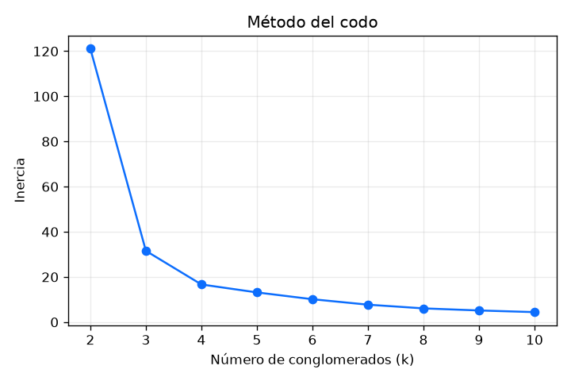
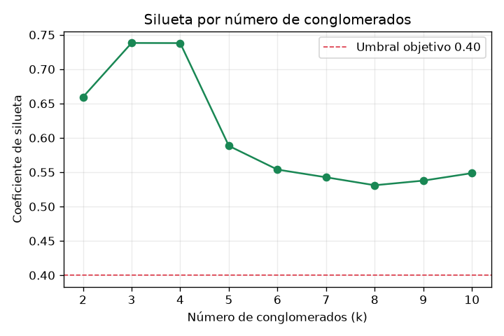
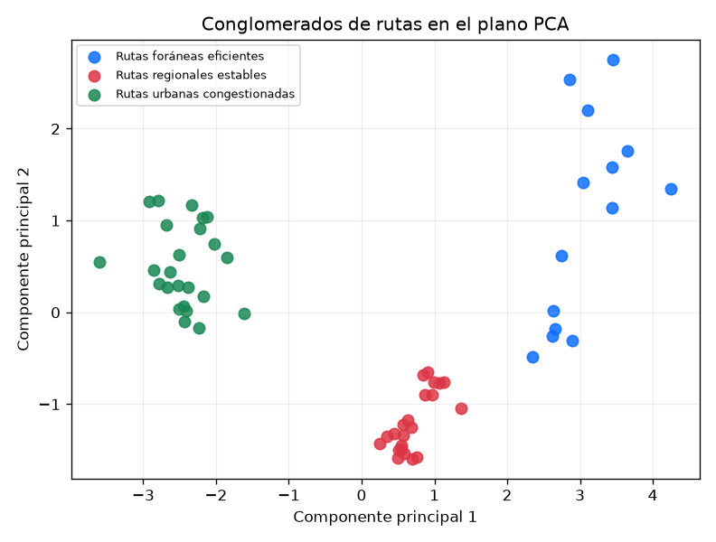

# Unidad IV — Análisis no supervisado

## 1. Justificación del algoritmo

### 1.1 Por qué PCA

El perfil de cada ruta se construye con siete variables agregadas
(`ml/datasets.py::ROUTE_PROFILE_FEATURES`): distancia, duración media, tasa
de retraso, retraso promedio, peso promedio de carga, costo por km y envíos
por mes. Dos de ellas —distancia y duración— están fuertemente
correlacionadas por construcción (una ruta más larga tarda más). El Análisis
de Componentes Principales (PCA) cumple dos funciones a la vez:
descorrelaciona esas variables al proyectarlas en componentes ortogonales, y
reduce el perfil a dos dimensiones que se pueden graficar directamente en un
plano — necesario para la figura de dispersión que responde visualmente
"¿hay grupos de rutas similares?" (P9).

### 1.2 Por qué K-means

K-means se eligió por dos razones prácticas para este conjunto: produce
centroides interpretables (el promedio de cada variable dentro del grupo,
que es exactamente lo que alimenta el nombre en español de cada
conglomerado — sección 2.4) y funciona bien sobre un conjunto pequeño y
denso como 60 rutas, sin necesitar los parámetros de vecindad o densidad que
otros algoritmos exigen.

### 1.3 Qué se descartó y por qué

- **DBSCAN** — agrupa por densidad y no exige fijar k de antemano, pero
  exige calibrar `eps` (radio de vecindad) y `min_samples`, y con solo 60
  rutas y una separación ya clara entre archetypes (urbano, regional,
  foráneo), esa calibración añade una capa de ajuste sin mejorar el
  resultado: los grupos aquí no tienen la forma irregular o el ruido disperso
  que es donde DBSCAN aventaja a K-means.
- **Agrupamiento jerárquico** — es apropiado para explorar dendrogramas de
  fusión sucesiva, o cuando el número de grupos no se conoce y se prefiere
  decidirlo mirando el árbol completo. Con 60 rutas ese árbol es legible,
  pero el proyecto ya cuenta con un criterio cuantitativo mejor —el barrido
  de k con silueta y Davies-Bouldin (sección 2)— que no requiere inspección
  visual de un dendrograma para decidir dónde cortar.

## 2. Descripción de los resultados

### 2.1 Barrido de k (método del codo y silueta)

| k | Inercia | Silueta | Davies-Bouldin |
|---|---|---|---|
| 2 | 121.08 | 0.6594 | 0.5085 |
| **3** | **31.55** | **0.7381** | **0.4034** ← elegido |
| 4 | 16.67 | 0.7380 | 0.3698 |
| 5 | 13.14 | 0.5883 | 0.6187 |
| 6 | 10.13 | 0.5538 | 0.6099 |
| 7 | 7.71 | 0.5426 | 0.6378 |
| 8 | 6.07 | 0.5310 | 0.6440 |
| 9 | 5.15 | 0.5377 | 0.6431 |
| 10 | 4.42 | 0.5486 | 0.5389 |

### 2.2 k elegido y su justificación

El criterio de selección (`ml/unsupervised.py::choose_k`) es la silueta más
alta; en empate, gana el k más pequeño. k=3 y k=4 empatan prácticamente en
silueta (0.7381 contra 0.7380 — una diferencia de una diezmilésima, dentro
del margen de variación numérica del algoritmo) y el desempate favorece a
k=3, tanto por la regla programada como por el criterio de negocio: **k=3
coincide exactamente con los tres arquetipos de ruta que el generador
sembró deliberadamente** (urbana, regional, foránea — ver
`seed/patterns.py::ROUTE_ARCHETYPES`). k=4 fragmentaría alguno de esos tres
grupos sin que exista una cuarta categoría operativa real detrás de esa
división, y su Davies-Bouldin ligeramente mejor (0.3698 contra 0.4034) no
compensa la pérdida de un agrupamiento que ya es interpretable de forma
directa contra el diseño del negocio.

### 2.3 Varianza explicada

PC1 explica el 70.94% de la varianza y PC2 el 17.79% — **88.74%** entre
ambos componentes. La gran mayoría de la variación entre rutas se captura
en un plano de dos dimensiones, lo que valida usar ese plano como la
representación visual principal del agrupamiento.

### 2.4 Perfil de cada conglomerado

| Conglomerado | Rutas | Distancia media | Duración media | Tasa de retraso | Retraso medio | Envíos/mes | Costo/km |
|---|---|---|---|---|---|---|---|
| **Rutas urbanas congestionadas** | 24 | 28.0 km | 94.8 min | 0.679 | 38.4 min | 40.3 | $28.95 |
| **Rutas foráneas eficientes** | 14 | 680.2 km | 524.2 min | 0.096 | 21.2 min | 5.9 | $18.87 |
| **Rutas regionales estables** | 22 | 171.2 km | 172.2 min | 0.114 | 11.3 min | 20.2 | $20.61 |

Los tres grupos corresponden, uno a uno, a los tres arquetipos sembrados
(URBANA → Rutas urbanas congestionadas, REGIONAL → Rutas regionales
estables, FORANEA → Rutas foráneas eficientes) tanto en conteo de rutas
(24/22/14, idéntico a `ROUTE_ARCHETYPES`) como en el orden de magnitud de
distancia y frecuencia. El agrupamiento no descubrió un patrón inesperado
— confirmó, con evidencia estadística (silueta 0.7381), que el patrón que
el generador sembró es recuperable a partir del comportamiento agregado de
cada ruta, sin haberle dado al algoritmo la etiqueta del arquetipo.

## 3. Reporte de evaluación y optimización

Con k = 3:

| Métrica | Valor | Umbral del proyecto |
|---|---|---|
| Coeficiente de silueta | **0.7381** | ≥ 0.40 (criterio de éxito) |
| Índice de Davies-Bouldin | 0.4034 | menor es mejor; sin umbral fijado |
| Varianza explicada (PC1+PC2) | 88.74% | — |

0.7381 supera casi al doble el umbral de 0.40 exigido — el agrupamiento no
solo cumple el criterio, lo hace con un margen amplio, señal de que los tres
grupos están bien separados y no son un artefacto del azar. Mirando el
barrido completo: la silueta cae de forma pronunciada después de k=4 (de
0.738 a 0.588 en k=5), lo que refuerza que 3–4 es la única región de valores
de k donde el conjunto realmente se separa en grupos compactos; valores de k
mayores fragmentan los tres grupos naturales en subconjuntos que ya no
corresponden a una diferencia operativa real, y la silueta lo penaliza en
consecuencia.

## 4. Interpretación operativa

- **Rutas urbanas congestionadas** (24 rutas, tasa de retraso 0.679,
  retraso medio 38.4 min, el costo por km más alto del conjunto): son el
  origen principal del problema de retrasos de toda la operación. La acción
  recomendada es revisar los horarios de salida que caen en horas pico y
  evaluar si conviene asignar a estas rutas vehículos más jóvenes (ver
  P7/P5 en `docs/U5_Visualizacion.md`), ya que concentran alta frecuencia
  (40.3 envíos/mes) y alto costo por kilómetro simultáneamente.
- **Rutas foráneas eficientes** (14 rutas, tasa de retraso 0.096, el costo
  por km más bajo): no requieren intervención. Son el grupo de referencia
  de buen desempeño operativo; conviene documentar qué hace distinta su
  operación (menor frecuencia, mayor margen de tiempo planeado) como
  posible modelo a imitar donde sea aplicable.
- **Rutas regionales estables** (22 rutas, comportamiento intermedio en
  todo): no son prioridad de intervención inmediata, pero su tasa de
  retraso (0.114) y costo por km ($20.61) son un punto de referencia útil
  para medir si una mejora aplicada a las rutas urbanas se traslada, con el
  tiempo, también a este grupo intermedio.
