# Unidad V — Presentación y visualización

## 1. Técnicas de visualización empleadas

| Técnica | Qué hace bien | Por qué se usó aquí |
|---|---|---|
| **Línea** | Mostrar una tendencia continua a lo largo del tiempo | Entregas y entregas con retraso mes a mes, en el panel general — permite ver si el problema de retrasos crece o se estabiliza. |
| **Barras apiladas** | Comparar un total y su composición interna a la vez | Costo por vehículo (combustible + mantenimiento): se necesita ver el total para ordenar, y la composición para decidir qué palanca mover. |
| **Barras horizontales** | Comparar muchas categorías con etiquetas de texto largas, sin amontonarlas | Rendimiento por vehículo (peor primero): los nombres de económico se leen mejor en el eje vertical que rotados en el eje horizontal. |
| **Dona** | Mostrar la proporción de un total pequeño de categorías | Combustible contra mantenimiento como proporción del gasto total, en el panel general. |
| **Pareto (barra + línea)** | Separar "los pocos que importan" del resto, con el acumulado visible | Causas de retraso: las barras muestran el conteo, la línea el porcentaje acumulado — así se ve de un vistazo dónde cae el 80%. |
| **Mapa de calor** | Mostrar la intensidad de un fenómeno cruzando dos variables categóricas | Día de la semana × hora, para "horarios de mayor saturación" (P10): color en vez de 168 números sueltos. |
| **Dispersión (scatter)** | Mostrar agrupamiento o cercanía entre observaciones en dos dimensiones | Rutas en el plano de componentes principales, coloreadas por conglomerado (P9). |

## 2. Herramientas y bibliotecas

El proyecto divide el trabajo gráfico en dos herramientas, cada una donde es
la correcta:

- **Chart.js** renderiza el dashboard interactivo (`templates/analytics/*.html`):
  tooltips al pasar el mouse, leyendas que se pueden ocultar por serie, y
  actualización sin recargar la página. Es la herramienta adecuada para una
  interfaz que alguien navega en vivo durante una demostración.
- **matplotlib** genera las figuras de diagnóstico de los modelos
  (`ml/evaluation.py`): matriz de confusión, curva del codo, gráfico de
  silueta, dispersión PCA y residuales de la regresión. Estas figuras se
  generan una vez por entrenamiento y se guardan como PNG en `static/ml/` —
  no necesitan interactividad, necesitan ser reproducibles y quedar
  archivadas junto al modelo que describen.

No es trabajo duplicado: son dos preguntas distintas ("¿qué le muestro a un
usuario navegando el sistema?" contra "¿cómo diagnostico un modelo ya
entrenado?") con la herramienta correcta para cada una. Que matplotlib
tenga su propio código en el repositorio también es, en sí mismo, el
entregable de código que la Unidad V exige.

**Contraste con Excel y Power BI** (herramientas que el temario nombra): Excel
y Power BI son adecuados para un analista que explora datos de forma libre y
construye reportes ad hoc sin escribir código. Aquí el objetivo es distinto:
las gráficas están acopladas a preguntas de negocio fijas y a modelos
entrenados por un pipeline reproducible, y necesitan vivir dentro de la
misma aplicación web que ya sirve el resto del sistema — exportar los datos a
una herramienta externa y mantener sincronizados dos sistemas habría sido
más trabajo, no menos. Las exportaciones a CSV y Excel (`apps/analytics/exports.py`)
sí existen, precisamente para el caso en que alguien quiera continuar el
análisis en Excel o Power BI fuera del sistema.

## 3. Código fuente de las gráficas

### 3.1 Ejemplo completo — matplotlib (`ml/evaluation.py`)

```python
def plot_silhouette(sweep, path=None):
    path = path or FIGURE_DIR / "silhouette.png"
    figure, axes = plt.subplots(figsize=(6.0, 4.0))
    axes.plot(
        [row["k"] for row in sweep], [row["silhouette"] for row in sweep],
        marker="o", color=PALETTE[2],
    )
    axes.axhline(0.40, color=PALETTE[1], linestyle="--", linewidth=1,
                 label="Umbral objetivo 0.40")
    axes.set_xlabel("Número de conglomerados (k)")
    axes.set_ylabel("Coeficiente de silueta")
    axes.set_title("Silueta por número de conglomerados")
    axes.legend()
    axes.grid(alpha=0.25)
    return _save(figure, path)
```

`matplotlib.use("Agg")` al inicio del módulo es lo que permite generar estas
figuras desde un comando de gestión sin un servidor de pantalla — necesario
porque `train_models` corre en un proceso sin interfaz gráfica.

### 3.2 Ejemplo completo — Chart.js (`templates/analytics/operations.html`, bloque `scripts`)

```javascript
const pareto = JSON.parse(document.getElementById("pareto-data").textContent);
new Chart(document.getElementById("paretoChart"), {
  data: {
    labels: pareto.labels,
    datasets: [
      { type: "bar", label: "Entregas con retraso", data: pareto.counts,
        backgroundColor: "#dc3545", yAxisID: "y" },
      { type: "line", label: "Acumulado %", data: pareto.cumulative,
        borderColor: "#fd7e14", yAxisID: "y1", tension: 0.2 }
    ]
  },
  options: {
    scales: {
      y: { position: "left", beginAtZero: true },
      y1: { position: "right", min: 0, max: 100, grid: { drawOnChartArea: false } }
    },
    plugins: { legend: { position: "bottom" } }
  }
});
```

Los datos llegan ya calculados desde `apps/analytics/queries.py::delay_causes_pareto`
(conteo por causa y su porcentaje acumulado) y se inyectan al HTML con
`{{ pareto_json|json_script:"pareto-data" }}` — la plantilla nunca hace
aritmética, solo dibuja lo que la vista ya calculó.

## 4. Dashboard y gráficas personalizadas

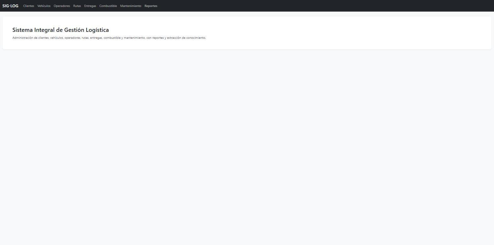

Página de bienvenida con acceso a los ocho módulos desde la barra de
navegación superior.

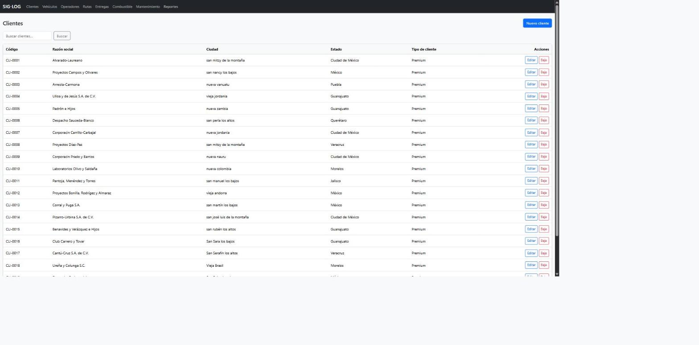

Patrón de lista común a los siete módulos de captura: buscador, tabla
paginada y acciones de editar/dar de baja por fila.

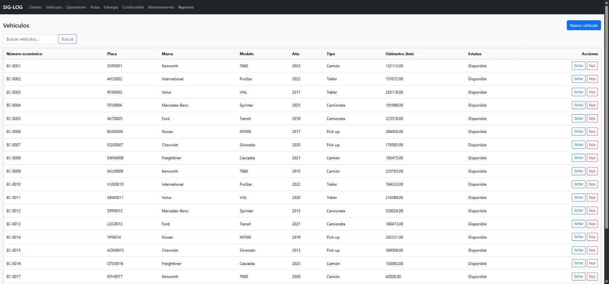

Inventario de la flotilla, con su estatus operativo visible en la última
columna.

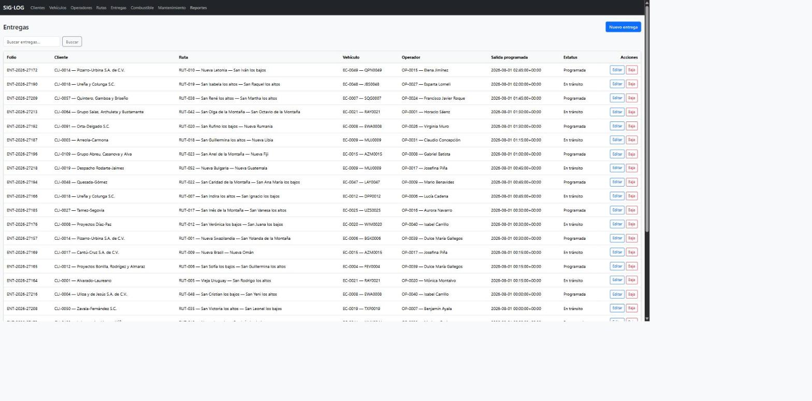

El módulo central del sistema: cada fila es una entrega con su cliente,
ruta, vehículo, operador y estatus.

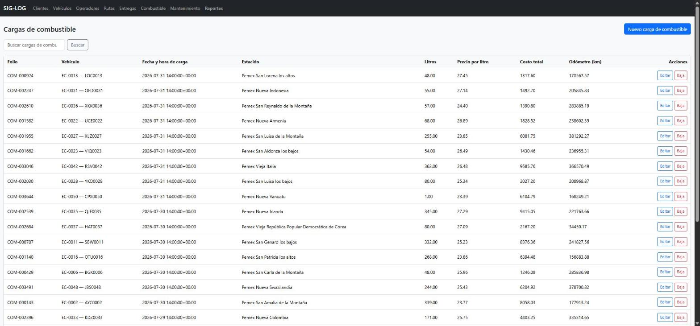

Cargas de combustible registradas, con el costo total ya calculado por
fila.

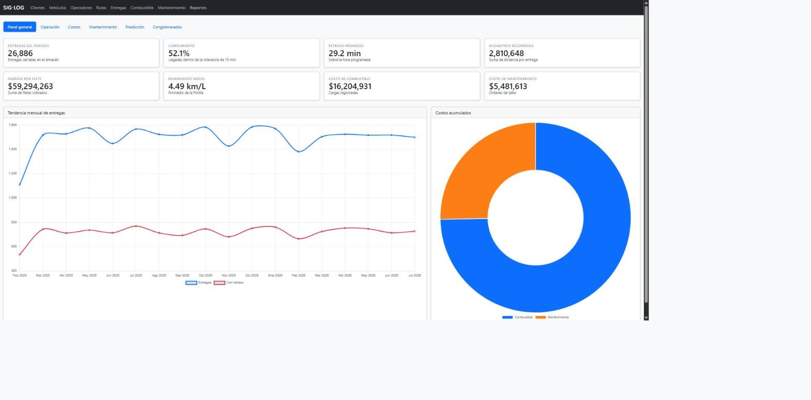

Ocho tarjetas de KPI (entregas del periodo, cumplimiento, retraso promedio,
kilómetros, ingreso por flete, rendimiento medio, costo de combustible,
costo de mantenimiento), la tendencia mensual de entregas contra entregas
con retraso, y la dona de costos. Sobre las 26,886 entregas cerradas del
almacén: 14,020 a tiempo y 12,866 con retraso — un cumplimiento de 52.2% y
un retraso promedio de 29.2 minutos sobre las que sí llegaron tarde
respecto a lo programado. El gasto acumulado es de $59,294,263 en flete
cobrado, $16,204,931 en combustible y $5,481,613 en mantenimiento, sobre
2,810,648 km recorridos.

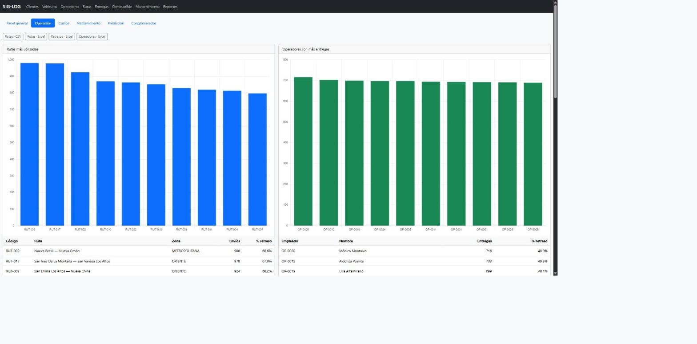

Rutas más utilizadas, operadores con más entregas, rutas con mayores
retrasos, el mapa de calor de saturación y el Pareto de causas — el detalle
de lectura de cada uno está en la sección 5.

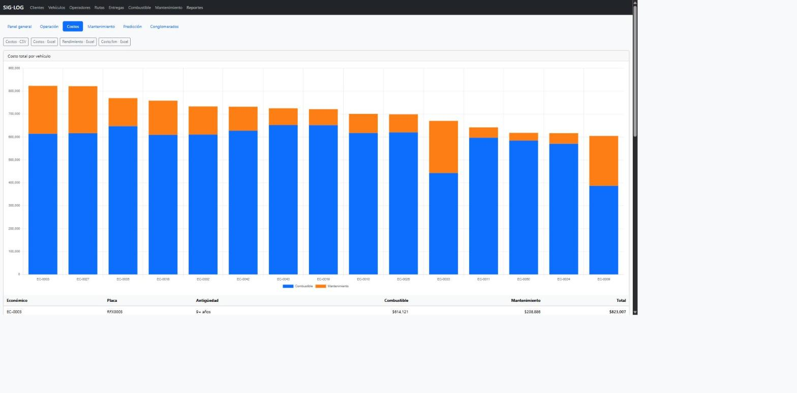

Costo total por vehículo (combustible contra mantenimiento), rendimiento
por vehículo y costo por kilómetro por ruta.

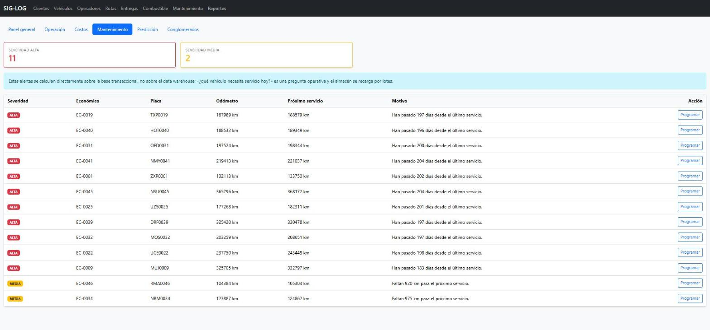

Vehículos que requieren servicio, clasificados por severidad; se calcula
sobre el OLTP, no sobre el almacén (razón en `docs/Arquitectura.md`,
decisión 6).

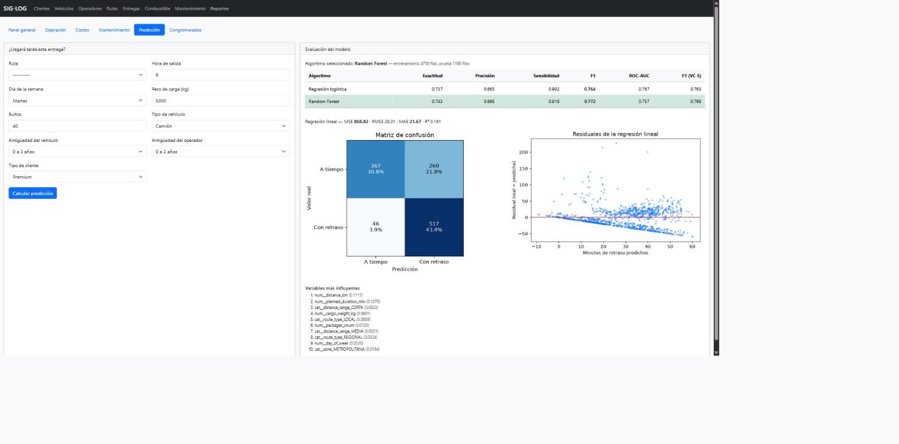

Formulario de predicción de retraso junto con la tabla de métricas de los
dos algoritmos comparados, la matriz de confusión, el gráfico de residuales
y las variables más influyentes.

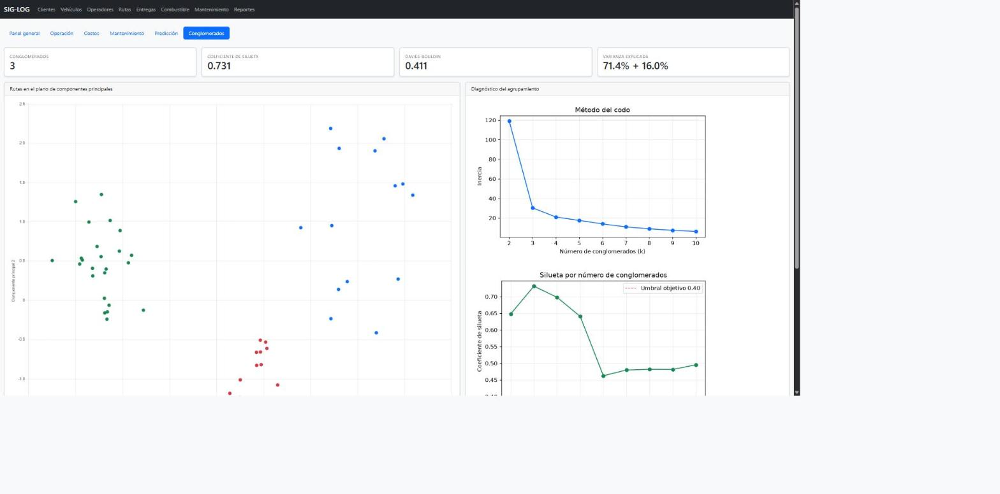

El plano de componentes principales coloreado por conglomerado, junto con
la tabla de perfil de cada grupo.

No existe una captura propia para las listas de Operadores, Rutas y
Mantenimiento, ni para el formulario de registro de llegada de una entrega
— su descripción textual está en `docs/Manual_Usuario.md`, secciones 3.3,
3.4, 3.7 y 4; su patrón visual es idéntico al de las listas ya mostradas
arriba.

## 5. Interpretación de resultados — las diez preguntas del caso de estudio

**P1 · ¿Qué rutas son más utilizadas?** Las cinco rutas con más envíos en
todo el periodo son RUT-009 (980 envíos), RUT-017 (978), RUT-002 (924),
RUT-010 (870) y RUT-022 (863) — las cinco en las zonas METROPOLITANA u
ORIENTE, consistente con que las rutas urbanas concentran entre 28 y 55
envíos mensuales por arquetipo, contra 12–26 en las regionales y solo 3–9 en
las foráneas. **Acción:** estas cinco rutas son las que más se benefician de
cualquier mejora operativa — son también las de mayor tasa de retraso (ver
P4), así que una misma intervención en ellas resuelve volumen y calidad de
servicio a la vez.

**P2 · ¿Qué vehículos generan mayores costos?** Los diez vehículos más
costosos en 18 meses son, los diez, **tráilers** (por ejemplo EC-0003:
$823,007 combinando $614,121 de combustible y $208,886 de mantenimiento;
EC-0027: $821,483). Esto tiene dos causas distintas que conviene no
confundir: el **tipo de vehículo** domina el costo total porque los tráilers
rinden 2.2 km/L contra 8.1 km/L de una pick-up, y el combustible pesa entre 3
y 8 veces más que el mantenimiento; la **antigüedad**, en cambio, domina
específicamente el costo de mantenimiento — el costo total medio de la
flota sube de forma monótona con la edad: $356,658 (0-3 años, 13 vehículos),
$432,814 (4-8 años, 21 vehículos), $497,556 (9+ años, 16 vehículos).
**Acción:** son dos decisiones distintas. Para bajar el gasto de combustible
hay que revisar qué rutas se asignan a tráilers (¿podrían cubrirse con un
camión de mayor rendimiento?); para bajar el gasto de mantenimiento hay que
revisar el plan de renovación de la flota, empezando por las unidades de
9+ años.

**P3 · ¿Qué operadores realizan más entregas?** Mónica Montalvo (OP-0020,
716 entregas), Aldonza Puente (OP-0012, 703), Lilia Altamirano (OP-0019,
699), Francisco Javier Roque (OP-0024, 697) y Estela Patiño (OP-0005, 697)
encabezan la lista, todos con una tasa de retraso entre 48% y 51% — cercana
al promedio global (47.9%), lo que indica que el volumen de entregas de un
operador no está sesgando su tasa de retraso: el retraso depende de la ruta
y la hora, no de quién conduce. **Acción:** ningún operador destaca como un
problema de desempeño individual; no hay evidencia aquí para justificar una
intervención de capacitación dirigida a los operadores de mayor volumen.

**P4 · ¿Qué rutas presentan mayores retrasos?** Entre rutas con al menos 20
envíos, las de mayor retraso promedio son RUT-012 (49.2 min, 69.5% de
retraso), RUT-011 (48.9 min, 67.6%), RUT-023 (48.3 min, 66.8%), RUT-006
(48.3 min, 70.4%) y RUT-022 (48.2 min, 70.9%) — de nuevo, todas en
METROPOLITANA u ORIENTE. La tasa de retraso en esas dos zonas congestionadas
es 0.6792 sobre 17,586 entregas, contra 0.1107 en el resto de las zonas
(9,572 entregas): una diferencia de más de seis veces. **Acción:** cualquier
programa de reducción de retrasos debe enfocarse en estas dos zonas
primero — intervenir en el resto de la red, donde la tasa ya es baja, tiene
mucho menor retorno.

**P5 · ¿Qué vehículos consumen más combustible (peor rendimiento)?** Los
cinco de peor rendimiento son EC-0018 (1.71 km/L), EC-0003 (1.71 km/L),
EC-0042 (1.72 km/L), EC-0027 (1.73 km/L) y EC-0011 (2.17 km/L) — todos
tráilers, y cuatro de los cinco de 9+ años. El rendimiento medio de la
flota es 4.49 km/L, muy por debajo de esos cinco. **Acción:** esta lista se
cruza directamente con P2 y P7 — son las mismas unidades (tráilers viejos)
las que generan el mayor costo y las que peor rendimiento tienen; un plan de
renovación de flota ataca ambos síntomas a la vez.

**P6 · ¿Cuáles son las causas principales de retraso?** Tráfico (4,428
casos), Carga y descarga (2,756) y Clima (1,769) son las tres causas más
frecuentes, seguidas de Documentación (1,450), Falla mecánica (1,309),
Accidente (660) y Otro (494), sobre un total de 12,866 entregas con causa
registrada. Tráfico y Carga y descarga por sí solas ya suman el 56% del
total. **Acción:** siguiendo la lectura del Pareto (sección 5 de
`docs/Manual_Usuario.md`), atacar tráfico y carga/descarga —ambas causas
operativas, no externas imprevisibles como el clima— es la intervención de
mayor retorno: revisar horarios de salida para evitar las horas de más
tráfico, y revisar el proceso de carga/descarga en almacén.

**P7 · ¿Qué vehículos requieren mantenimiento?** Se responde en tiempo real
desde `vehicles.services.maintenance_alerts()` (pantalla "Alertas de
mantenimiento"), no con una cifra fija de este documento: un vehículo entra
en severidad alta si ya rebasó su kilometraje de servicio, si nunca ha
tenido un servicio registrado, o si pasaron más de 180 días desde el
último; en severidad media si le faltan 1,000 km o menos. **Acción:** es,
por diseño, una lista que cambia cada día — la acción es operativa
inmediata (programar el servicio), no una decisión de política como en las
demás preguntas.

**P8 · ¿Es posible predecir si una entrega llegará tarde?** Sí, con un F1
de 0.7795 sobre el conjunto de prueba (regresión logística, ganadora sobre
Random Forest) y una sensibilidad de 0.9141 — el modelo atrapa el 91% de los
retrasos reales. Su precisión (0.6795) queda prácticamente en la tasa base
de retraso en zona congestionada (0.6792), que funciona como un techo
práctico más que como una debilidad del modelo (análisis completo en
`docs/U3_Analisis_Supervisado.md`, sección 4). **Acción:** el modelo es útil
como alerta temprana (¿esta entrega necesita seguimiento proactivo?), no
como una promesa exacta de horario.

**P9 · ¿Podemos identificar grupos de rutas similares?** Sí, tres grupos con
silueta 0.7381 (casi el doble del umbral de 0.40): rutas urbanas
congestionadas (24), rutas foráneas eficientes (14) y rutas regionales
estables (22) — ver `docs/U4_Analisis_No_Supervisado.md` para el perfil
completo de cada uno y qué hacer al respecto.

**P10 · ¿Cuáles son los horarios de mayor saturación y la demanda por
servicio?** Las horas con más salidas son las 17h (3,296 entregas), 8h
(3,252), 18h (3,161), 19h (3,131), 7h (3,094) y 9h (3,068) — las seis
franjas pico definidas en el sistema (`time_band` PICO_AM/PICO_PM), y ningún
otro conjunto de horas se acerca a ese volumen. La demanda por día de la
semana es, en cambio, casi uniforme: entre 4,445 y 4,506 entregas por día de
lunes a sábado (no hay operación en domingo). **Acción:** la saturación es
un fenómeno de hora, no de día — cualquier medida de mitigación (más
unidades disponibles, ventanas de entrega más amplias) debe concentrarse en
las seis horas pico, no distribuirse por día de la semana.
